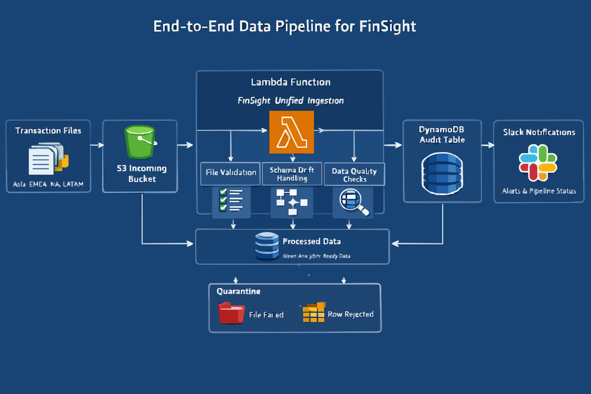

# FinSight Data Engineering Pipeline

An end-to-end serverless data ingestion and validation pipeline built on AWS that processes global financial transaction data, performs schema governance, enforces data quality rules, and delivers analytics-ready datasets.

This project simulates a real-world data engineering workflow where transaction files from multiple regions are ingested, validated, standardized, and audited automatically.

---

# Project Overview

FinSight Corp receives daily transaction files from multiple global regions including Asia, EMEA, North America, and LATAM. These files arrive in a centralized cloud storage location and must be processed before they can be used for analytics and reporting.

However, the incoming datasets can contain multiple issues such as:

- Invalid or partially uploaded files
- Schema inconsistencies
- Missing required columns
- Incorrect business data values
- Duplicate file ingestion
- Lack of visibility into pipeline health

To address these problems, I designed and implemented a **fully automated serverless data pipeline** that validates, cleans, and standardizes the incoming data while maintaining a complete audit trail.

The final system ensures that only **clean, analytics-ready data** is delivered to downstream systems while preserving rejected records and operational metadata for traceability.

---

# Architecture

The pipeline is built entirely using AWS serverless services.

**Core Components**

- Amazon S3 — Data lake storage
- AWS Lambda — Unified ingestion and processing logic
- Amazon DynamoDB — Audit logging and observability
- Slack Webhook — Operational alerts and monitoring
- IAM — Secure access control



---

# Data Pipeline Workflow

The ingestion pipeline follows a structured multi-stage processing flow.

## 1. File Ingestion

Transaction files are uploaded into the `incoming/` folder of the S3 bucket using the naming format:

```
transactions_<region>_<YYYY-MM-DD>.csv
```

Example:

```
transactions_asia_2025-09-01.csv
```

Uploading a file automatically triggers the pipeline through an **S3 event notification**.

---

## 2. Metadata Extraction

The pipeline extracts important metadata directly from the file name:

- Region
- File date
- File name

This metadata is used to determine partition paths and validation rules.

---

## 3. File-Level Validation

Before processing the file contents, several structural checks are performed:

- File name must follow the required naming pattern
- Region must be valid
- File must contain data (not empty or header-only)

If any validation fails:

```
quarantine/file_failed/dt=<file_date>/
```

The file is moved to the quarantine zone and the failure reason is recorded in the audit table.

---

## 4. Schema Standardization & Drift Handling

Incoming files may contain inconsistent column names or schema variations.

The pipeline uses two configuration files stored in the `config/` directory:

### schema_mapping.json
Maps non-standard column names to canonical names.

Example:

```
txn_id -> transaction_id
curr -> currency
txt_amount -> transaction_amount
```

### schema_master.json
Maintains the current schema version and column definitions.

The pipeline automatically handles:

- Column renaming
- Missing mandatory columns
- New columns introduced by upstream systems

When new valid columns are detected, the pipeline **updates the schema version automatically**.

---

## 5. Row-Level Data Quality Validation

Each row in the dataset is validated using business rules:

### Validation Rules

- `transaction_id` cannot be null
- Region must be one of: Asia, EMEA, NA, LATAM
- `transaction_amount` must be numeric and greater than zero
- Currency must match the expected currency for the region

| Region | Currency |
|------|------|
| Asia | INR |
| EMEA | EUR |
| NA | USD |
| LATAM | BRL |

---

## 6. Data Output

After validation, the pipeline separates the data into two categories.

### Clean Data

Written to:

```
processed/dt=<file_date>/
```

These records are ready for analytics.

### Rejected Rows

Written to:

```
quarantine/row_rejected/dt=<file_date>/
```

Rejected records contain an additional column:

```
error_reason
```

This explains why the record failed validation.

---

# Audit & Observability

Every processed file generates a detailed audit record stored in DynamoDB.

### DynamoDB Table
```
finsight-unified-audit
```

### Key Metrics Stored

- File processing status
- Source file path
- Processed file location
- Rejected row location
- Schema version used
- Schema drift events
- Total records processed
- Valid records
- Invalid records
- Data Quality Score

### Data Quality Score

```
(valid_records / total_records) * 100
```

This metric provides a quick indicator of dataset reliability.

---

# Slack Notifications

Once processing is complete, the pipeline sends a Slack notification summarizing the outcome.

Three alert types exist:

### Success

```
File processed successfully
Records processed
DQ Score
```

### Warning

```
File processed with rejected rows
Total records
Rejected rows
DQ Score
```

### Failure

```
File failed validation
Failure reason
```

This provides real-time pipeline monitoring without checking logs.

---

# Key Features

- Fully automated serverless ingestion pipeline
- File-level and row-level data validation
- Automatic schema drift detection and evolution
- Data quality scoring
- Centralized audit logging
- Slack-based operational alerts
- Quarantine zone for traceability
- Idempotent processing to prevent duplicate ingestion

---

# Folder Structure

```
finsight-de-anshuman
│
├── incoming/
│
├── processed/
│   └── dt=YYYY-MM-DD/
│
├── quarantine/
│   ├── file_failed/
│   │   └── dt=YYYY-MM-DD/
│   └── row_rejected/
│       └── dt=YYYY-MM-DD/
│
└── config/
    ├── schema_mapping.json
    └── schema_master.json
```

---

# IAM Security

A dedicated IAM role was created for the Lambda function with least-privilege permissions:

- Read/Write access to the S3 bucket
- Read/Write access to DynamoDB audit table
- CloudWatch logging access

This ensures secure and controlled pipeline execution.

---

# Result

The final solution is a **robust production-style ingestion framework** capable of:

- Automatically validating incoming datasets
- Handling schema changes without code modifications
- Enforcing strict data quality rules
- Maintaining full pipeline observability
- Delivering clean, analytics-ready data

The system improves reliability, traceability, and operational monitoring while simulating real-world data engineering practices used in modern data platforms.
